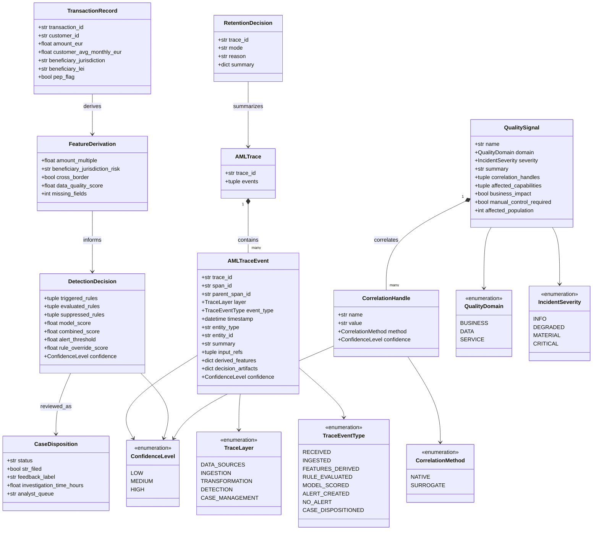
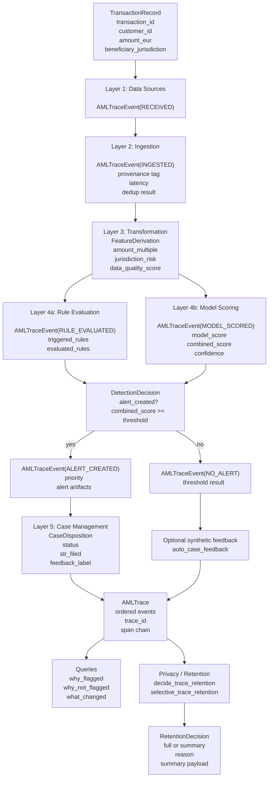

# Beyond AI — Observability Layer

**Status: 🟡 PoC + Architekturmodul**

Der `observability/`-Layer ist der technische Kern fuer die These, dass AML
haeufig nicht nur ein Detektionsproblem, sondern ein Observability-Problem ist.
Die Frage lautet nicht nur: "Hat das System einen Alert erzeugt?", sondern:
"Laesst sich rekonstruieren, warum etwas erkannt, nicht erkannt, unterdrueckt
oder falsch weitergegeben wurde?"

## Die drei Qualitaetsdimensionen

Beyond AI behandelt Observability nicht als reines IT-Monitoring, sondern als
Layer ueber drei Ebenen:

- `Business-Qualitaet`
  Erkennen Regeln, Modelle und Workflows noch die richtigen Risiken?
- `Daten-Qualitaet`
  Kann das Institut der Entscheidungsbasis trauen?
- `IT-Service-Qualitaet`
  Laeuft die Erkennungskette technisch noch integer?

## Designregeln

1. Nicht jedes Datenproblem ist ein Compliance-Problem.
2. Nicht jede technische Degradation gehoert ins Compliance-Cockpit.
3. Sichtbar werden nur Signale mit `Business Impact`.
4. Korrelationen ohne native Trace-ID brauchen `Surrogat-IDs` mit
   `Confidence Levels`.
5. Die Navigationslogik ist wichtiger als die Kachelzahl:
   `fachliches Symptom -> Datenursache -> IT-Ursache -> Massnahme`.

## Architektur

```
                   Beyond AI Product Modules
      sanctions/        horizon/          osint/
           │                │                │
           └────────────────┼────────────────┘
                            │
                    observability/
                            │
      ┌─────────────────────┼─────────────────────┐
      │                     │                     │
Detection Integrity     Data Trust         Service Health
      │                     │                     │
      └─────────────────────┼─────────────────────┘
                            │
                    Business Impact Map
                            │
                    Compliance Cockpit
```

## Struktur des PoC

```text
observability/
├── README.md
├── __init__.py
├── models.py
├── trace.py
├── collector.py
├── detector.py
├── case_mgmt.py
├── privacy.py
├── pipeline.py
├── queries.py
├── data/
│   ├── synthetic_transactions.jsonl
│   └── synthetic_cases.jsonl
├── notebooks/
│   └── walkthrough.ipynb
└── scripts/
    ├── __init__.py
    ├── generate_synthetic_data.py
    └── run_demo.py
```

## Mermaid-Datenmodell

<details>
<summary>Datenmodell aufklappen</summary>



</details>

## Mermaid-Flowchart

<details>
<summary>Flowchart aufklappen</summary>



</details>

## Kernartefakte

- `QualitySignal`
- `CorrelationHandle`
- `IncidentSeverity`
- `SurfaceTarget`
- `AMLTraceEvent`
- `AMLTrace`

Diese Modelle liegen in `shared/observability/` und sind bewusst
moduluebergreifend formuliert: Der Sanctions Screener, der Horizon Scanner und
spaetere Graph- oder Workflow-Komponenten sollen dieselbe Sprache fuer
Qualitaet und Impact sprechen.

## Was der PoC jetzt konkret liefert

- `models.py`
  Domain-Modelle fuer Transaktionen, Feature-Derivation, Detection Decisions,
  Case Dispositions und Retention Decisions.
- `trace.py`
  Lokale Trace-Helfer plus Re-Export der shared Trace-Primitiven.
- `detector.py`
  Eine kleine, nachvollziehbare Kombination aus Feature-Ableitung, Regelpfad
  und Model-Score.
- `case_mgmt.py`
  Synthetische Case-Management-Logik fuer Priorisierung und Feedback-Artefakte.
- `privacy.py`
  Selektive Trace-Retention als technischer Haken fuer die
  GDPR/Data-Minimization-Diskussion.
- `pipeline.py`
  End-to-end-Durchlauf durch die fuenf Layer.
- `queries.py`
  Compliance-nahe Debug-Fragen wie `why_flagged`, `why_not_flagged` und
  `what_changed`.
- `scripts/run_demo.py`
  Ein lauffaehiger Demo-Einstieg mit JSONL-Daten.
- `notebooks/walkthrough.ipynb`
  Ein kleines Schaufenster fuer Reviewer, Demos und Paper-Walkthroughs.

Damit ist der Layer nicht mehr nur Architekturtext, sondern ein kleiner,
testbarer Implementierungs-Blueprint fuer AML Observability.

## Schnellstart

### Demo laufen lassen

Aus dem Repo-Root:

```bash
python3 -m observability.scripts.run_demo
```

### Fixtures neu erzeugen

```bash
python3 -m observability.scripts.generate_synthetic_data
```

### Relevante Tests

```bash
pytest -q tests/test_observability_trace.py
pytest -q tests/test_observability_pipeline.py
pytest -q tests/test_observability_queries.py
```

## Warum die Struktur so aussieht

- Nicht alles steckt in `pipeline.py`, damit die Architektur als PoC lesbar
  bleibt.
- `shared/observability/` bleibt die moduluebergreifende Sprache fuer Beyond AI.
- `observability/` selbst enthaelt die spezifische AML-Demo und den
  referenzierbaren Proof of Concept.
- `data/`, `scripts/` und `notebooks/` machen den Unterschied zwischen
  "interessanter Idee" und "das laeuft wirklich".

## Was dieser Layer bewusst nicht ist

- kein allgemeines NOC-Dashboard
- kein ungefilterter Data-Quality-Alarmstrom
- kein Ersatz fuer Modellvalidierung oder interne Revision
- kein Versuch, jede lokale technische Stoerung in die Compliance zu werfen

## Roadmap

- [ ] Impact-aware Signals aus `sanctions/` einspeisen
- [ ] JSONL-Export und Import fuer echte Vendor-TM- oder Shadow-Pipeline-Daten
- [ ] Read-only Detection Integrity fuer Vendor-TM-Exports vorbereiten
- [ ] Data-Trust-Indikatoren fuer Referenzdatenfeeds definieren
- [ ] Service-Health-Signale mit Business Impact verknuepfen
- [ ] Compliance-Cockpit-Projektion als eigene API/Oberflaeche ableiten
